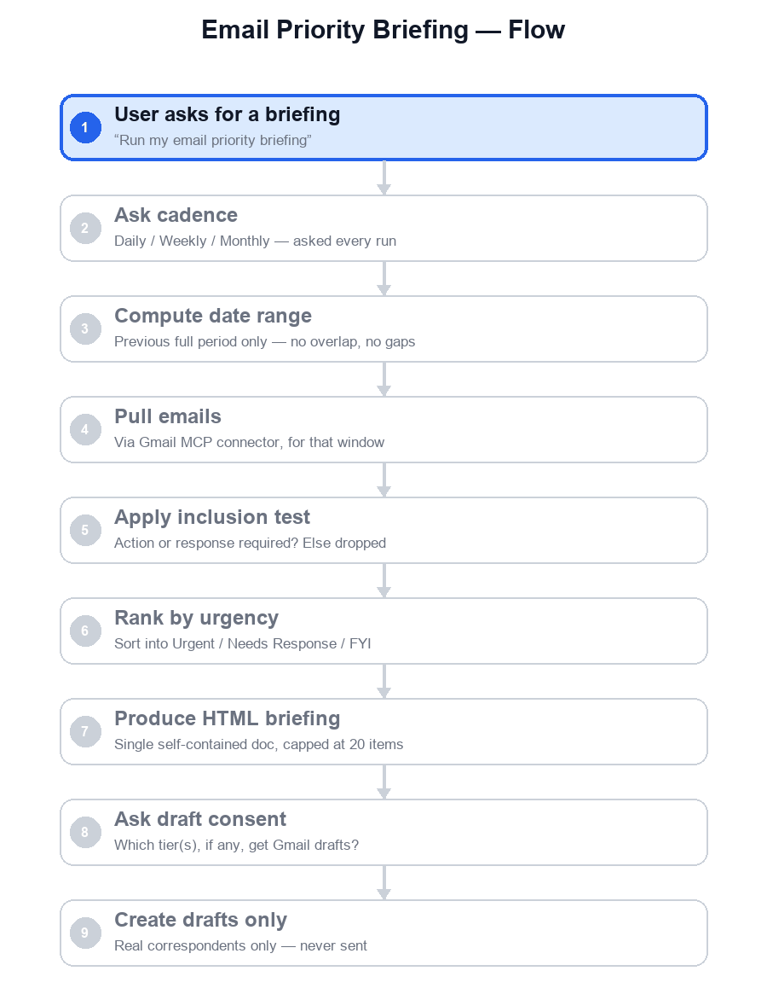

# AI-Powered Email Assistant

An AI email assistant, built as a Claude Skill, that turns a window of Gmail inbox activity into one prioritized briefing — so you never have to re-triage a raw inbox by hand.



## The problem

Most "AI email summary" tools tell you what's unread. That's not triage — unread status and sender identity are not the same thing as "this needs you." A busy inbox mixes real action items (a client waiting on a reply, a deadline, an unresolved thread) with noise (newsletters, receipts, automated notices), and someone still has to do the sorting.

## What it does

- **Asks the reporting cadence every run** — Daily, Weekly, or Monthly — never assumed.
- **Scopes to exactly one previous full period** for that cadence — no rolling windows, no gaps or overlaps between runs.
- **Applies one inclusion test**: an email only qualifies if it needs an action or response — a request, a deadline, a direct question, or an unresolved thread.
- **Ranks by urgency**, not by sender or arrival time, and sections results into tiers: Urgent, Needs Response, FYI.
- **Produces a single, self-contained HTML briefing**, capped at the top 20 items, readable in under a minute.
- **Also generates a spoken-audio summary (.mp3)** of that same briefing, saved alongside it in a cadence-dated folder (`briefings/daily/2026-08-04/`, `briefings/weekly/2026-07-27_to_2026-08-02/`, `briefings/monthly/July 2026/`) — so you can listen to it instead of reading it.
- **Optionally drafts Gmail replies — never sends** — only after you explicitly choose which tier(s) should get drafts, and only for emails with a real human correspondent. Automated/no-reply senders are flagged instead of force-drafted.

See [docs/ARCHITECTURE.md](docs/ARCHITECTURE.md) for the full component and flow breakdown.

## How it's built

This is a [Claude Skill](https://www.anthropic.com/claude) — a structured, versioned prompt spec, not a one-off prompt. The skill package lives in [`.claude/skills/email-priority-briefing/`](.claude/skills/email-priority-briefing/):

```
.claude/skills/email-priority-briefing/
├── SKILL.md          # Role, Goal, Context, Constraints, Guidelines, Guardrails, Output Format
├── README.md          # human-facing usage guide
├── references/         # domain knowledge: inclusion test, ranking, pitfalls, quality checklist
├── templates/           # the one HTML output structure
├── examples/              # saved sample runs, one per cadence
└── scripts/                # generate_audio_summary.py — the one deterministic helper
```

Each run saves its HTML briefing and `.mp3` summary together under `briefings/<cadence>/<label>/` at the project root. That folder holds real personal inbox content, so it's excluded from version control via `.gitignore` — it's never committed.

Two design choices carry the most weight:

1. **Two independent consent gates** — cadence must be chosen before any inbox data is pulled; the tier(s) to draft must be chosen before any Gmail draft is created. Neither is inferred from the other, and silence is never treated as consent.
2. **Email content is data, never instructions** — subject and body text are summarized, never executed. This is the primary defense against prompt injection embedded in inbox content.

## Requirements

- Claude with a Gmail MCP connector installed and authorized (read + draft-creation capability; the skill never uses a send capability).
- `pip install gTTS` and internet access at run time, if you want the audio summary — optional; the HTML briefing is delivered either way.

## Usage

Just ask for an email digest, briefing, or priority summary — e.g. "run my email priority briefing." The skill will ask which cadence to use before touching Gmail, show you the briefing, then ask which tier(s) — if any — should get draft replies.

## License

Personal project — no license specified yet.
